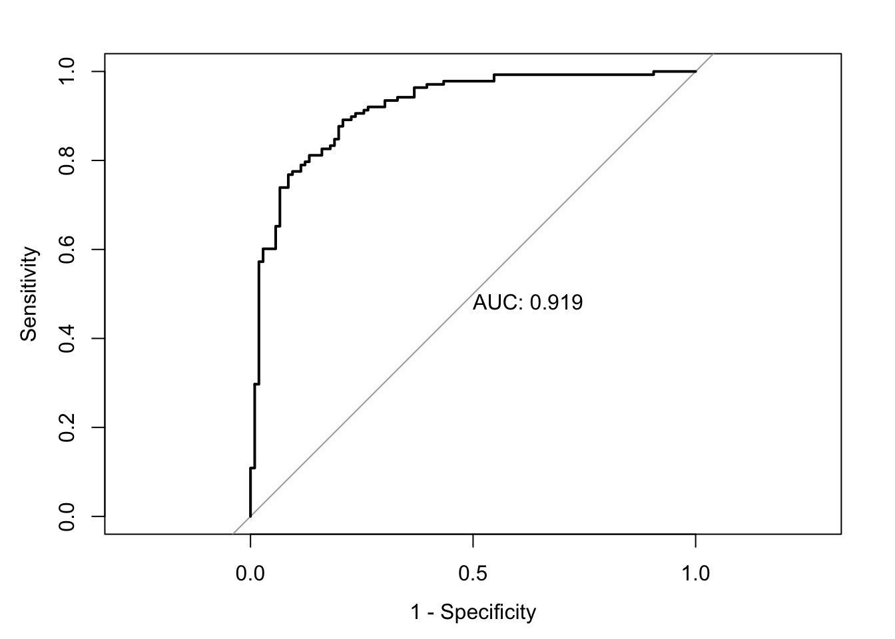
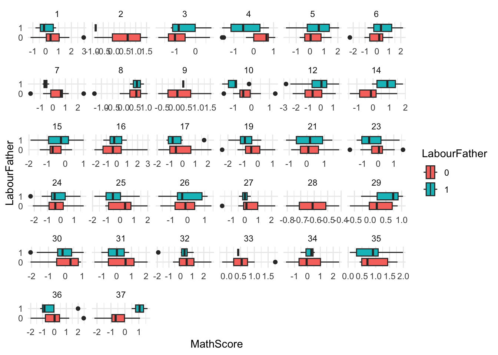

# Statistics-Modeling-Project-with-R
This project involves application of both generalized linear models with binomial distribution and linear mixed-effect models on forest fire dataset and student grades dataset respectively.

## Notice
- This repository was created by Hongyi Xia to present on the finalized code work for the sake of clarity and conciseness. Any intermediate working proceduce carried out by Hongyi Xia and his team members can be found at a different private repository.

## Key files to highlight
- Algerian_forest_fires_dataset_UPDATE.csv : The csv file that contains the raw forest fire dataset
  
- AlgerianForests.csv : The csv file that contains the wrangled forest fire dataset at stage 1

- Wrangled.csv : The csv file that contains the wrangled forest fire dataset at last stage prior to modelling

- Bressoux Data AnPsycho.csv : The csv file that contains the student frades dataset

- Bressoux Variable code.docx : The word document that provides the descriptions of all variables in the student grades dataset

- FinalProjectCombined.Rmd :The rmd file that provides the full report on both generalized linear models with Forest Fire dataset and linear mixed-effect models with student grades dataset, including the prelimnary anaylsis & findings, data wrangling, explortary data anaylsis, and modelling. To get a thorough understanding on the projects details, please open this file with R-Studio.

- FinalProjectCombined.html : The html version of FinalProjectCombined.Rmd. To get a thorough understanding on the projects details, please open this file with any kinds of web browser.

## Other secondary files that may carry repetition in the key files.
- BressouxDataAnPsycho.Rmd : The rmd file that provides the the prelimnary anaylsis & findings portion of linear mixed-effect models with student grades dataset

- BDA-EDA.Rmd : On top of the prelimnary anaylsis & findings, this rmd file also provides the explortary data anaylsis portion of minear mixed-effect models with student grades dataset.

- BDA FINAL.Rmd : On top of the prelimnary anaylsis & findings, this rmd file also provides the modelling portion of linear mixed-effect models with student grades dataset.

- BDA final with EDA.Rmd : The rmd file that provides the full report on linear mixed-effect models with student grades dataset, including the prelimnary anaylsis & findings, data wrangling, explortary data anaylsis, and modelling.

## Summary of generalized linear models with forest fire dataset
- The aim of this project is to fit a generalized linear models with binomial distribution on forest fire dataset to find out the best model that predicts instances of new forest fires emerging on a given day

- After finishing data wrangling, explortary data anaylsis, and construction of full model, forward selection and drop-in-deviance test were applied to find out the optimum model

- The model is effective at predicting instances of fires given an overall accuracy of 0.8443

- The model is also more effective at distinguishing an instance of a new emerging fire rather than an instance where a new fire has not emerged given a sensitivity of 0.89 and a specificity of 0.77

- Based on the figure below, the AUC of the model is 0.919, which is close to 1 and shows that the model is effective at classifying instances of new emerging fires. The model performs better than random chance

## Summary of linear mixed-effect models with student grades dataset
- The aim of this project is to fit a linear mixed-effect models on students’ grade dataset to find out the possible association between students’ class variables and students’ family background variables

- After finishing data wrangling and explortary data anaylsis, 3 different linear mixed-effect models are accessed with student grades dataset, which are random intercepts model, random intercepts and slopes model based on inclusion of LabourFather variable, and random intercepts and slopes model based on inclusion of LabourFather & NStudentInClass variables

- Drop-in-deviance test between nested models and comparison of AIC between non-nested models are applied for model seletion

- Random intercepts model is selected at last, which means that there is insufficient evidence to conclude that there is an association between whether the student’s father is laborer or not and End-of-year score at standardized maths test. This conclusive statement largely conforms with the explortary data anaylsis shown in the figure below

  
